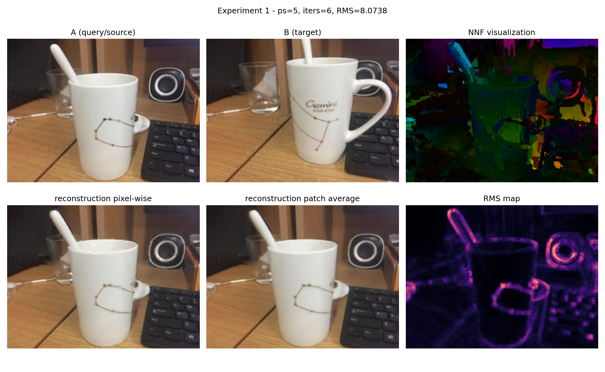

# Computer Vision Project: PatchMatch & Deformable ConvNets

Questa repository raccoglie due progetti di Computer Vision:

1. **PatchMatch**, un approccio classico e randomizzato per la stima efficiente di corrispondenze dense tra patch e per applicazioni di image reconstruction e inpainting.
2. **Deformable Convolutional Networks (DCN)**, un approccio deep learning in cui le posizioni di campionamento delle convoluzioni vengono adattate al contenuto mediante offset appresi.

L'obiettivo della repository non è riprodurre integralmente le pipeline originali dei due paper, ma fornire implementazioni compatte, interpretabili e riproducibili, accompagnate da esperimenti quantitativi e visualizzazioni qualitative.

## Struttura della repository

```text
.
├── PatchMatch/
│   ├── patchmatch.py             # Core PatchMatch e inpainting multi-scala Search + Vote
│   ├── demo.py                   # Nove esperimenti quantitativi e qualitativi
│   ├── cup_a.jpg                 # Immagine query/source di esempio
│   ├── cup_b.jpg                 # Immagine target di esempio
│   └── results/                  # Figure prodotte dagli esperimenti
│
├── Deformable ConvNets/
│   ├── models.py                 # StandardCNN, DeformableCNN e blocchi deformabili
│   ├── train.py                  # Training e confronto su MNIST/FashionMNIST
│   ├── experiment_geometric.py   # Robustezza a rotazione, scala e shear
│   ├── visualize_offsets.py      # Griglie deformate e heatmap degli offset
│   ├── visualize_feature_maps.py # Confronto delle feature response interne
│   ├── toy_layers.py             # Toy example dei principali operatori
│   ├── demo.py                   # Esecuzione dell'intera pipeline sperimentale
│   ├── requirements.txt
│   └── results/                  # Pesi, metriche JSON e figure gia generate
│
└── README.md
```

## Installazione

La repository usa Python, NumPy, Matplotlib, OpenCV, SciPy, Pillow e PyTorch/Torchvision. È consigliato lavorare in un ambiente virtuale.

```bash
python -m venv .venv
```

Attivazione su Linux/macOS:

```bash
source .venv/bin/activate
```

Attivazione su Windows PowerShell:

```powershell
.venv\Scripts\Activate.ps1
```

Installare prima le dipendenze del progetto DCN e poi quelle aggiuntive usate da PatchMatch:

```bash
python -m pip install --upgrade pip
python -m pip install -r "Deformable ConvNets/requirements.txt"
python -m pip install opencv-python scipy pillow
```

> **Nota:** `torchvision.ops.DeformConv2d` deve essere disponibile nella build installata di Torchvision. Il codice DCN è configurato esplicitamente per l'esecuzione su CPU.

---

# Progetto 1 - PatchMatch

## Obiettivo

PatchMatch stima un **Nearest-Neighbor Field (NNF)** tra due immagini. Per ogni posizione dell'immagine query `A`, il campo memorizza la posizione della patch più simile trovata nell'immagine target `B`.

L'algoritmo combina tre passaggi:

1. **Inizializzazione casuale** del campo di corrispondenze.
2. **Propagazione**, sfruttando la coerenza spaziale tra patch vicine.
3. **Random search**, esplorando finestre di ricerca progressivamente più piccole attorno al match corrente.

La distanza tra patch è una **MSE normalizzata**; nei grafici la metrica sintetica usata è:

```text
RMS = sqrt(mean(NND))
```

Dove `NND` è la mappa delle distanze associate alle corrispondenze del NNF.

## Implementazione

Il file `PatchMatch/patchmatch.py` contiene:

- inizializzazione di `NNF` e `NND`;
- propagazione in scanline order e reverse order;
- random search con raggio esponenzialmente decrescente;
- ricostruzione pixel-wise;
- ricostruzione mediante media di patch sovrapposte;
- visualizzazione del NNF in HSV;
- storico dell'evoluzione iterativa;
- inpainting multi-scala **Search + Vote** con confidence map.

Nell'inpainting, la pipeline costruisce una piramide coarse-to-fine e alterna:

- **Search:** PatchMatch vincolato a patch sorgenti interamente note;
- **Vote:** aggregazione delle patch sovrapposte per aggiornare i pixel mancanti.

## Esecuzione

```bash
cd PatchMatch
python demo.py
```

Nel codice fornito, `RUN_ALL` è impostato a `False`: l'esecuzione predefinita avvia soltanto l'esperimento 8, cioè il confronto PatchMatch vs LaMa.

Per eseguire tutti gli esperimenti, modificare la variabile in fondo a `PatchMatch/demo.py`:

```python
RUN_ALL = True
```

Quindi eseguire nuovamente:

```bash
python demo.py
```

Le figure nuove vengono salvate nella directory di esecuzione. Gli artefatti inclusi nella repository sono raccolti in `PatchMatch/results/`.

### Esperimenti disponibili

| # | Esperimento | Descrizione |
|---:|---|---|
| 1 | NNF e ricostruzione | NNF in HSV, ricostruzione pixel-wise, patch voting e mappa RMS |
| 2 | Convergenza | Evoluzione della RMS dopo inizializzazione, propagazione e random search |
| 3 | Inpainting multi-scala | Completion coarse-to-fine tramite Search + Vote |
| 4 | PatchMatch vs ground truth | Confronto con brute force esatta su un sottoinsieme di query |
| 5 | Patch size | Effetto della dimensione della patch su qualità e tempo |
| 6 | Toy example | Evoluzione step-by-step su una traslazione sintetica |
| 7 | Failure cases | Texture ripetitive e strutture lunghe che attraversano il buco |
| 8 | PatchMatch vs LaMa | Confronto qualitativo e MSE nella regione mascherata |
| 9 | Applicazioni | Object removal, scratch repair e logo removal |

## Uso diretto del core

Esempio minimale da eseguire dentro la cartella `PatchMatch/`:

```python
import numpy as np
from PIL import Image

from patchmatch import patchmatch, reconstruct_from_patches

A = np.array(Image.open("cup_a.jpg").convert("RGB"))
B = np.array(Image.open("cup_b.jpg").convert("RGB"))

nnf, nnd = patchmatch(
    A,
    B,
    patch_size=5,
    iterations=6,
    alpha=0.5,
    attempts=2,
    seed=0,
)

reconstruction = reconstruct_from_patches(nnf, B, patch_size=5)
Image.fromarray(reconstruction).save("reconstruction.png")

rms = float(np.sqrt(np.maximum(nnd.mean(), 0.0)))
print(f"RMS: {rms:.4f}")
```

## Esempio di risultato

<p align="center">
  
</p>

---

# Progetto 2 - Deformable ConvNets

## Obiettivo

Le convoluzioni standard campionano sempre su una griglia regolare. Le **Deformable Convolutional Networks** aggiungono offset 2D appresi, rendendo il pattern di campionamento dipendente dal contenuto locale:

```text
y(p0) = sum_n w(pn) * x(p0 + pn + delta_pn)
```

Per un kernel `k x k`, il ramo che predice gli offset produce `2 * k * k` canali. Gli offset sono inizializzati a zero, quindi ogni blocco deformabile parte con un comportamento equivalente a una convoluzione standard e apprende successivamente come modificare il proprio receptive field.

## Implementazione

Il progetto sostituisce gli operatori custom C++/CUDA della repository originale con `torchvision.ops.DeformConv2d`, utilizzabile anche su CPU. Il contesto sperimentale viene inoltre semplificato da detection a classificazione su **MNIST** e **FashionMNIST**.

Sono confrontati due modelli:

- **StandardCNN:** blocchi convoluzionali standard, pooling e classificatore finale;
- **DeformableCNN:** primi layer standard e tre blocchi deformabili negli stadi successivi, con salvataggio esplicito degli offset per la visualizzazione.

## Esecuzione completa

```bash
cd "Deformable ConvNets"
python demo.py
```

La pipeline completa:

1. addestra StandardCNN e DeformableCNN su MNIST e FashionMNIST;
2. salva pesi, metriche JSON e curve di training;
3. visualizza i punti di campionamento e le heatmap degli offset;
4. valuta la robustezza a rotazione, scala e shear;
5. genera toy visualizations degli operatori;
6. confronta le feature response interne dei due modelli.

Il training usa, per impostazione predefinita:

```text
train subset: 5000 campioni
test subset:  1000 campioni
epoche:       3
batch size:   256
device:       CPU
```

L'esecuzione completa può richiedere diversi minuti, soprattutto per la DeformableCNN e per i test geometrici.

## Esecuzione dei singoli moduli

I pesi preaddestrati sono già presenti in `Deformable ConvNets/results/`, quindi è possibile rigenerare le analisi qualitative senza ripetere necessariamente il training:

```bash
cd "Deformable ConvNets"

python visualize_offsets.py
python experiment_geometric.py
python toy_layers.py
python visualize_feature_maps.py
```

Per ripetere soltanto il confronto di training:

```bash
python train.py
```

### Esperimenti disponibili

| # | Esperimento | Descrizione |
|---:|---|---|
| 1 | StandardCNN vs DeformableCNN | Loss, accuracy, parametri e costo di inferenza |
| 2 | Offset appresi | Griglia standard, sampling deformato e heatmap della magnitudine |
| 3 | Robustezza geometrica | Test su rotazioni, variazioni di scala e shear |
| 4 | Toy layers | Convoluzione standard/deformabile, pooling e interpolazione bilineare |
| 5 | Feature responses | Confronto delle attivazioni interne nei diversi stadi della rete |

## Esempio di risultato

<p align="center">
  
</p>

---

# Risultati principali

## PatchMatch

Gli esperimenti mostrano che:

- la maggior parte del miglioramento del NNF avviene nelle prime iterazioni;
- sul subset usato per il confronto con brute force, PatchMatch ottiene una RMS media circa il **5% superiore all'ottimo esatto**, con un rapporto medio `PM/GT = 1.051`;
- la ricostruzione con media di patch sovrapposte è generalmente più stabile della copia pixel-wise;
- il framework multi-scala Search + Vote è adatto a inpainting locale, object removal e scratch repair;
- texture fortemente ripetitive e strutture geometriche lunghe evidenziano i limiti del matching locale.

## Deformable ConvNets

Le metriche salvate nella repository riportano le seguenti best test accuracy nel setup ridotto a tre epoche:

| Dataset | StandardCNN | DeformableCNN |
|---|---:|---:|
| MNIST | 90.4% | **95.8%** |
| FashionMNIST | 71.0% | **75.6%** |

Il numero di parametri passa da **148,074** a **174,048**. Il miglioramento di accuracy e robustezza geometrica è accompagnato da un overhead rilevante su CPU, sia in training sia in inferenza.

I test geometrici indicano il vantaggio più netto nelle variazioni di scala; per trasformazioni molto estreme, entrambe le reti degradano e la deformabilità locale non sostituisce una specifica augmentation o una vera equivarianza geometrica.

---

# Riproducibilita e note operative

- I dataset MNIST e FashionMNIST vengono scaricati automaticamente da Torchvision nella cartella `data/`.
- `train.py` fissa i seed di PyTorch e NumPy e usa subset deterministici.
- Gli esperimenti PatchMatch che espongono un parametro `seed` possono essere resi riproducibili impostandolo esplicitamente.
- Le metriche temporali dipendono da CPU, versione delle librerie e carico del sistema.
- Le immagini e i file di output vengono scritti mediante percorsi relativi: eseguire gli script dalla rispettiva cartella di progetto.
- La cartella `PatchMatch/lama_outputs/` non è inclusa nello ZIP. In assenza degli output esterni di LaMa, l'esperimento 8 salva input e maschera e mostra un placeholder al posto del risultato LaMa.

# Limiti

### PatchMatch

- Il metodo riutilizza patch esistenti e non possiede una comprensione semantica della scena.
- Buchi grandi, strutture globali e geometrie non presenti nel contesto possono produrre discontinuità o ricostruzioni ambigue.
- L'implementazione è orientata alla chiarezza sperimentale e usa cicli Python; non è ottimizzata per immagini ad alta risoluzione.

### Deformable ConvNets

- Il progetto studia la classificazione e non implementa la pipeline completa di detection, deformable RoI pooling o position-sensitive RoI pooling del lavoro originale.
- I risultati sono ottenuti su subset ridotti e non costituiscono un benchmark state of the art.
- `DeformConv2d` su CPU introduce un costo computazionale considerevole.
- Le visualizzazioni di offset e feature map forniscono evidenza qualitativa, ma non dimostrano una relazione causale diretta tra un singolo offset e la decisione finale.

# Riferimenti

- Connelly Barnes, Eli Shechtman, Adam Finkelstein, Dan B. Goldman, **PatchMatch: A Randomized Correspondence Algorithm for Structural Image Editing**.
- Jifeng Dai et al., **Deformable Convolutional Networks**.
- Implementazione PatchMatch usata come riferimento: <https://github.com/MingtaoGuo/PatchMatch>
- Repository originale Deformable ConvNets: <https://github.com/msracver/Deformable-ConvNets>

